# Search Reranking Diagrams

Generated with `docs/generate_search_reranking_diagrams.mjs` on `2026-03-18T23:40:01.397Z`.

These diagrams show the top 10 results before and after reranking.
Arrows are only drawn for titles that appear in both lists.

## Query: `transform`

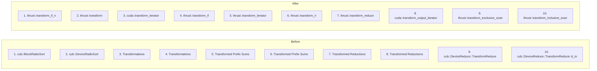

## Query: `reduce`

```mermaid
flowchart LR
  subgraph before[Before]
    b1["1. cp.reduce.async.bulk"]
    b2["2. cp.reduce.async.bulk.global.shared::cta.bulk_group.min.bf16"]
    b3["3. cp.reduce.async.bulk.global.shared::cta.bulk_group.min.f16"]
    b4["4. cp.reduce.async.bulk.shared::cluster.shared::cta.mbarrier::complete_tx::bytes.and.b32"]
    b5["5. cp.reduce.async.bulk.tensor"]
    b6["6. cp.reduce.async.bulk.tensor.1d.global.shared::cta.add.tile.bulk_group"]
    b7["7. CUDASTF"]
    b8["8. cub::AgentReduceByKeyPolicy"]
    b9["9. cub::AgentReduceByKeyPolicy::BLOCK_THREADS"]
    b10["10. cub::AgentReduceByKeyPolicy::BlockThreads"]
  end
  subgraph after[After]
    a1["1. thrust::reduce"]
    a2["2. thrust::reduce_into"]
    a3["3. thrust::reduce_by_key"]
    a4["4. cub::BlockReduce"]
    a5["5. cub::DeviceReduce"]
    a6["6. cub::DeviceSegmentedReduce"]
    a7["7. cub::WarpReduce"]
    a8["8. cub::DispatchReduceByKey"]
    a9["9. cub::BLOCK_REDUCE_RAKING"]
    a10["10. cub::BLOCK_REDUCE_RAKING_COMMUTATIVE_ONLY"]
  end
```

## Query: `BlockRadixSort`

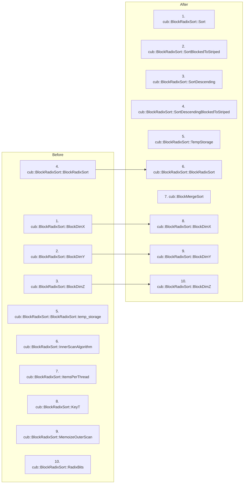

## Query: `zip_iterator`

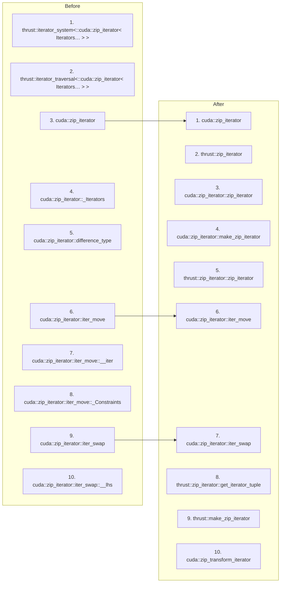

## Query: `coop`

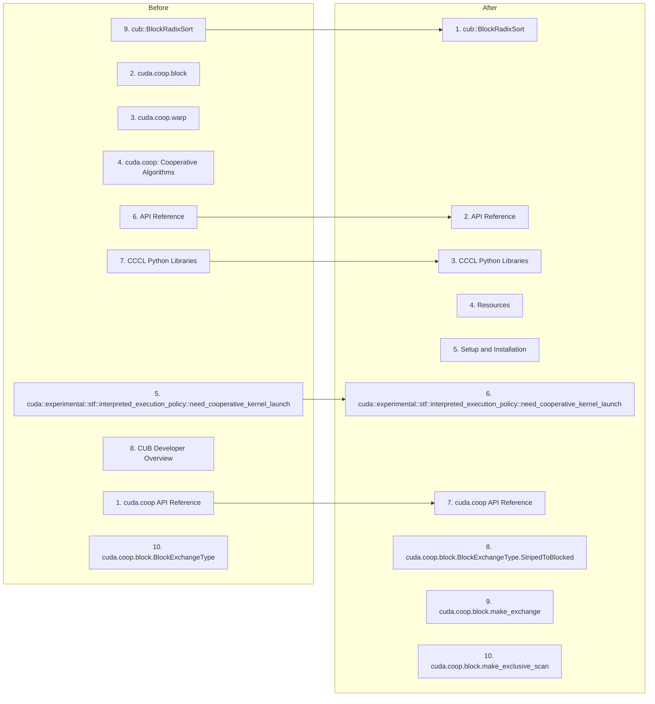

## Query: `iterator`

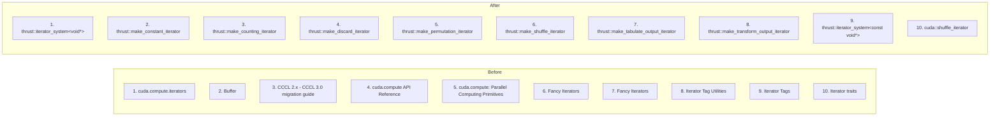

## Query: `block`

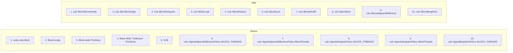

## Query: `sort`

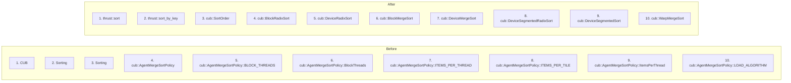

## Query: `histogram`

```mermaid
flowchart LR
  subgraph before[Before]
    b1["1. cub::AgentHistogramPolicy::BLOCK_THREADS"]
    b2["2. cub::AgentHistogramPolicy::BlockThreads"]
    b3["3. cub::AgentHistogramPolicy::IS_RLE_COMPRESS"]
    b4["4. cub::AgentHistogramPolicy::IS_WORK_STEALING"]
    b5["5. cub::AgentHistogramPolicy::LOAD_ALGORITHM"]
    b6["6. cub::AgentHistogramPolicy::LOAD_MODIFIER"]
    b7["7. cub::AgentHistogramPolicy::LoadAlgorithm"]
    b8["8. cub::AgentHistogramPolicy::LoadModifier"]
    b9["9. cub::AgentHistogramPolicy::MEM_PREFERENCE"]
    b10["10. cub::AgentHistogramPolicy::MemoryPreference"]
  end
  subgraph after[After]
    a1["1. cub::BlockHistogram"]
    a2["2. cub::DeviceHistogram"]
    a3["3. cub::BlockHistogram::InitHistogram"]
    a4["4. cub::DeviceHistogram::HistogramEven"]
    a5["5. cub::DeviceHistogram::HistogramRange"]
    a6["6. cub::DeviceHistogram::MultiHistogramEven"]
    a7["7. cub::DeviceHistogram::MultiHistogramRange"]
    a8["8. cub::BlockHistogram::Composite"]
    a9["9. cub::BlockHistogram::TempStorage"]
    a10["10. cub::BlockHistogram::BlockHistogram"]
  end
```

## Query: `scan`

```mermaid
flowchart LR
  subgraph before[Before]
    b1["1. cub::AgentRadixSortDownsweepPolicy::SCAN_ALGORITHM"]
    b2["2. cub::AgentRadixSortDownsweepPolicy::ScanAlgorithm"]
    b3["3. cub::AgentRadixSortOnesweepPolicy::SCAN_ALGORITHM"]
    b4["4. cub::AgentRadixSortOnesweepPolicy::ScanAlgorithm"]
    b5["5. cub::AgentReduceByKeyPolicy::SCAN_ALGORITHM"]
    b6["6. cub::AgentReduceByKeyPolicy::ScanAlgorithm"]
    b7["7. cub::AgentRlePolicy::SCAN_ALGORITHM"]
    b8["8. cub::AgentRlePolicy::ScanAlgorithm"]
    b9["9. cub::AgentScanByKeyPolicy::BLOCK_THREADS"]
    b10["10. cub::AgentScanByKeyPolicy::BlockThreads"]
  end
  subgraph after[After]
    a1["1. cub::BlockScan"]
    a2["2. cub::DeviceScan"]
    a3["3. cub::DeviceSegmentedScan"]
    a4["4. cub::WarpScan"]
    a5["5. cub::BLOCK_SCAN_RAKING"]
    a6["6. cub::BLOCK_SCAN_RAKING_MEMOIZE"]
    a7["7. cub::BLOCK_SCAN_WARP_SCANS"]
    a8["8. cub::SCAN_TILE_INCLUSIVE"]
    a9["9. cub::SCAN_TILE_INVALID"]
    a10["10. cub::SCAN_TILE_OOB"]
  end
```

## Query: `stream`

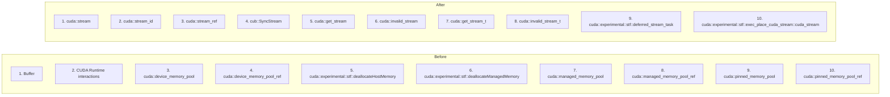

## Query: `memory resource`

```mermaid
flowchart LR
  subgraph before[Before]
    b1["1. Buffer"]
    b2["2. cuda::device_memory_pool"]
    b3["3. cuda::experimental::uninitialized_buffer"]
    b4["4. cuda::managed_memory_pool"]
    b5["5. cuda::managed_memory_pool_ref"]
    b6["6. cuda::mr::basic_any_resource"]
    b7["7. cuda::mr::shared_resource"]
    b8["8. cuda::pinned_memory_pool"]
    b9["9. CUDASTF"]
    b10["10. Legacy resources"]
  end
  subgraph after[After]
    a1["1. cuda::buffer::memory_resource"]
    a2["2. cuda::experimental::uninitialized_buffer::memory_resource"]
    a3["3. thrust::device_memory_resource"]
    a4["4. thrust::host_memory_resource"]
    a5["5. thrust::universal_host_pinned_memory_resource"]
    a6["6. thrust::universal_memory_resource"]
    a7["7. cuda::mr::legacy_managed_memory_resource::allocate_sync"]
    a8["8. cuda::mr::legacy_managed_memory_resource::deallocate_sync"]
    a9["9. cuda::mr::legacy_managed_memory_resource::get_property"]
    a10["10. cuda::mr::legacy_pinned_memory_resource::allocate_sync"]
  end
```
