# Search Reranking SVGs

Generated with `docs/generate_search_reranking_svgs.mjs` on `2026-03-18T23:45:57.064Z`.

## Query: `transform`

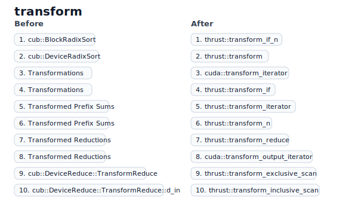

## Query: `reduce`

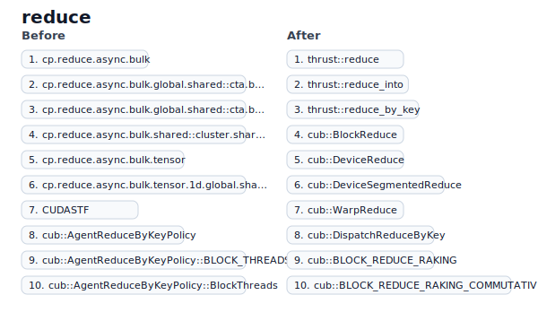

## Query: `BlockRadixSort`

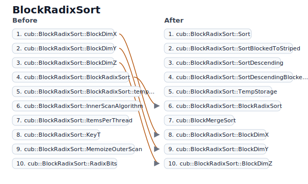

## Query: `zip_iterator`

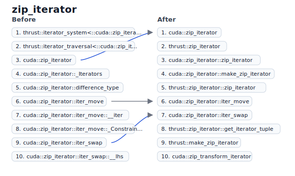

## Query: `coop`

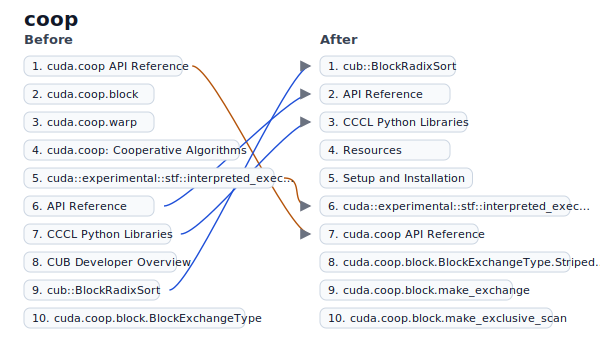

## Query: `iterator`

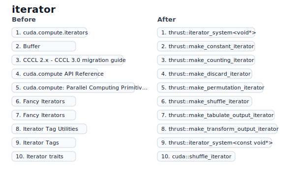

## Query: `block`

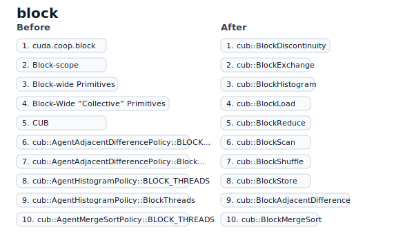

## Query: `sort`

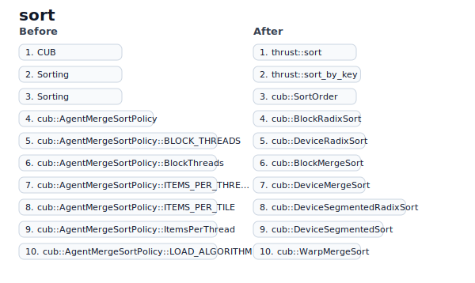

## Query: `histogram`

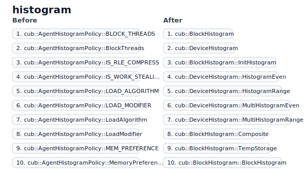

## Query: `scan`

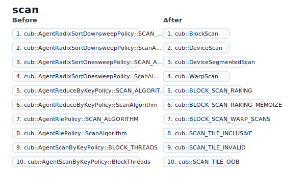

## Query: `stream`

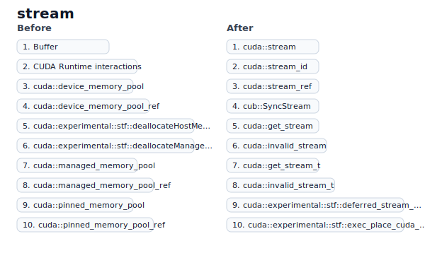

## Query: `memory resource`

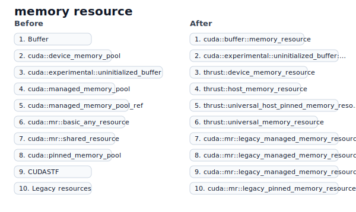
